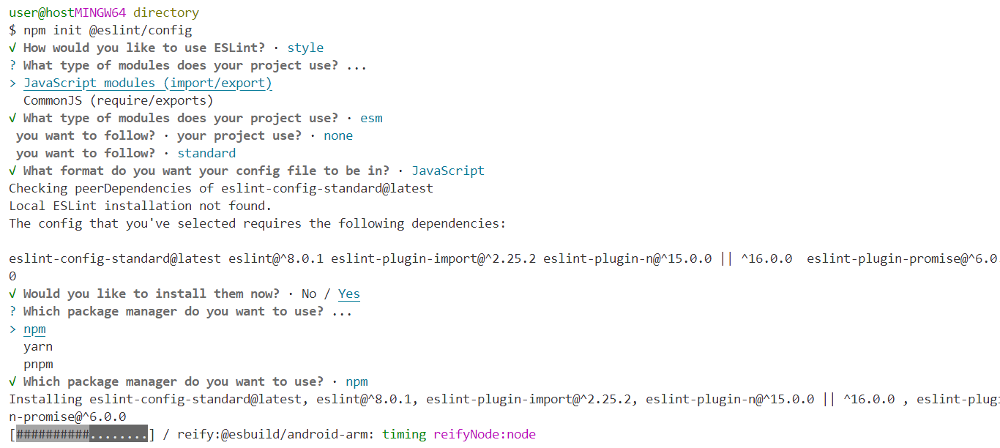

# Exercice 1 : version module

---

## Enoncé

1. Installez et configurer le module Eslint.
Un outil d'analyse statique (sans execution du code) pour vérifier les erreurs dans son code et s'assurer une meilleure qualité du code grâce à la vérification des bonnes pratiques du langage depuis un fichier de configuration.

- Vous effectuez la configuration d'ESLINT depuis le terminal et la racine de votre projet, copiez/collez la commande suivante : `npm init @eslint/config` et laissez-vous guider et faites vos choix pour la suite (cf. illustration ci-dessous).
- Ajoutez un script dans le fichier package.json dédié aux vérifications d'ESLint  et un autre pour corriger toutes les erreurs et warning.
Appuyez-vous sur cette [documentation](https://eslint.org/docs/latest/use/command-line-interface) 

2. Vous pouvez vous appuyer sur la documentation d'[Esbuild](https://esbuild.github.io/getting-started/#bundling-for-the-browser) pour traiter cette question.
Installez Esbuild et créez un script dans le package.json pour effectuer le build (compilation)
- Le fichier en sortie (à nommer comme vous l'entendez) doit : 
- Être chargé depuis vos pages HTML.
- Minifié

---

## Illustration

### ESLINT config

