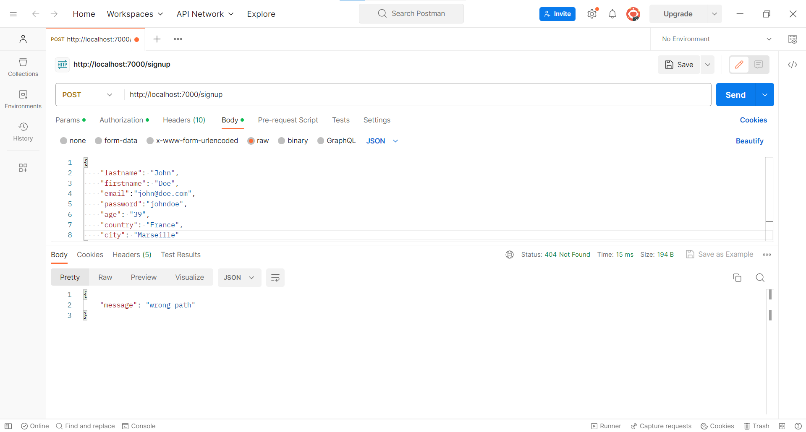

# Exercice 9 : gestion de l'inscription

---

## Modalités

- Effectuez vos tests via **`postman`** ou **`hoppscotch`** dans un premier, le lien entre le front et le back-end sera effectué plus tard.
- Utilisez l'extension **`SQLite Viewer`** d'`alexcvzz` pour visualiser votre base de données (schéma et données).

---

## Enoncé

1. Gérez l'inscription d'un nouvel utilisateur depuis un serveur web (*API REST NODE JS*).
2. Stockez les utilisateurs dans une base données embarquée *SQLite3*, le script gérant les opérations en base de données est fourni.

---

## Instructions pour le script de la base de données

1. Installez *sqlite3* avec la commande `npm i sqlite3` : permet d'avoir une base de données SQL léger dans un fichier et donc embarqué dans l'application.
2. Copiez ce [script des opérations en base de données](./ressource/db.mjs) dans le repertoire de votre exercice ainsi que les [requêtes de la base de données](./ressource/user-table-requests.mjs) dont vous aurez besoin pour cette exercice et le suivant.
3. Créez un fichier avec une extension `.sqlite`, ce fichier est notre future base de données pour stocker les utilisateurs.

---

## Spécifications techniques

Effectuez vos appels sur le serveur *Node* via `postman` ou `hoppscotch`.

1. Les données depuis le client `postman` ou `hoppscotch` doivent être envoyé au format ***JSON***.
- 
2. Caractéristiques du serveur back-end :
- Écoute sur le port `8000` ;
- Méthode `POST` ;
- URL `/signup` ;
3. Réponses selon les scénarios :
- Si l'utilisateur existe déja dans la base de données, le serveur doit répondre au format ***JSON***  `{"message": "user already exists"}` avec un code HTTP `404`.
- Si l'utilisateur a été ajouté dans la base de données, le serveur répond au format ***JSON*** `{"message": "sucess"}` avec un `code HTTP` égale à `201`.
- Dans tous les autres cas retourner un `code HTTP 404`.